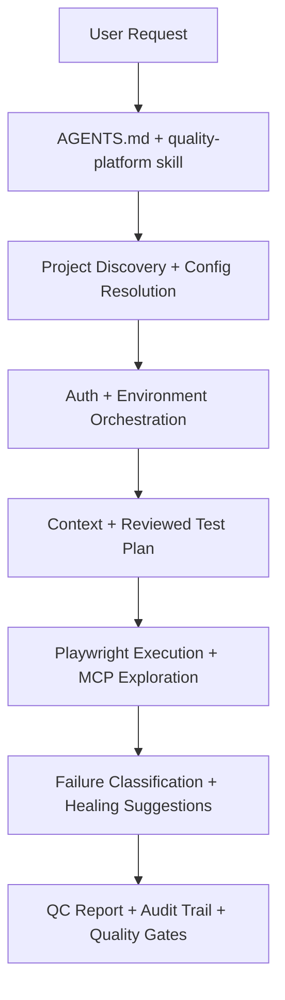
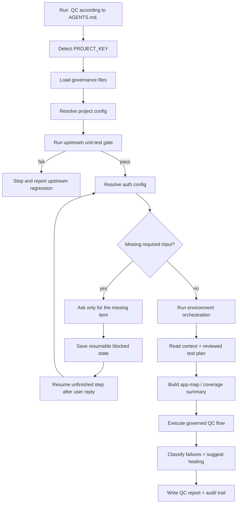
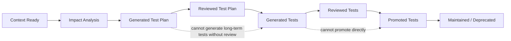

# quality-platform

`quality-platform` is an **AI-native Autonomous QC Platform** for governed Playwright-based quality operations.

It is:

- AI QC Agent Runtime
- Test Governance Platform
- Playwright Execution Layer
- Playwright MCP Exploration Layer
- Auth Bootstrap Layer
- Project Discovery Layer
- Failure Classification Layer
- Healing Suggestion Layer
- CI Quality Gate Layer
- Audit and Reporting Layer

It is not:

- A generic Playwright starter
- A place for unit tests owned by concrete product or service repositories
- A repo for changing or backfilling business-project internal unit-test suites
- A home for real business selectors, endpoints, or production write workflows in tracked files

## Visual Overview

```mermaid
flowchart LR
    subgraph Governance
        G1["AGENTS.md"]
        G2["skills/quality-platform/SKILL.md"]
        G3["ai-task-contract"]
    end
    subgraph Runtime
        R1["Project Discovery"]
        R2["Auth Bootstrap"]
        R3["Environment Orchestration"]
        R4["App Map / Coverage Map"]
        R5["MCP Runtime"]
        R6["Playwright Execution"]
    end
    subgraph Output
        O1["Failure Attribution"]
        O2["Healing Suggestions"]
        O3["QC Report"]
        O4["Audit Log"]
    end
    Governance --> Runtime --> Output
```





## Advanced Runtime Capabilities

The framework now includes first-class support for:

- Failure attribution and healing-loop analysis
- Test data and environment orchestration
- MCP exploration manifests and artifact recording
- App-map and coverage-gap reporting
- Missing-input detection with resumable blocked-state files

## One-line Usage

Future users should be able to say:

`Run hiring QC according to AGENTS.md.`

The framework and AI workflow will expand that into:

1. Detect `PROJECT_KEY=hiring`
2. Read governance files
3. Resolve project config
4. Run the configured unit-test gate first when the target system exposes an existing unit-test command
5. Detect configured unit-test coverage and summarize per-module coverage when coverage commands are declared
6. Stop immediately if a required unit-test gate fails
7. Resolve auth config
8. Check auth state
9. Bootstrap local auth when needed
10. Read context
11. Read reviewed test plan
12. Select tests
13. Execute or prepare QC
14. Generate a standard QC report

If required configuration is missing during the workflow, the AI should ask only for that missing configuration, save sensitive values only to local Git-ignored secret config files, and then continue the unfinished task.

## Visual Workflow



## Test Asset Lifecycle



## Core Commands

```bash
npm run typecheck
npm run validate:structure
npm run ai:check
npm run guard:all

npm run project:resolve -- --project hiring
npm run check:unit-coverage -- --project hiring
npm run orchestrate:test-env -- --project hiring
npm run check:app-map -- --project hiring
npm run mcp:explore -- --project hiring --request "Explore auth and dashboard"
npm run cleanup:test-artifacts -- --project hiring
npm run auth:check -- --project hiring
npm run auth:login -- --project hiring
npm run qc -- --project hiring
```

## Minimal Setup

```bash
npm install
cp .env.example .env
```

Windows users can use a shell that supports inline env vars or add `cross-env` later if the team decides it is worth the extra dependency. Phase 1 keeps dependencies minimal.

For local secret reuse, the framework also supports `.secrets/<project-key>/<TEST_ENV>.local.json`. That file is ignored by Git and can store local-only auth URLs, usernames, passwords, tokens, or MFA-related values when a user explicitly provides them.

## How To Read The Repo

- `AGENTS.md`: global operating rules and non-negotiable guardrails
- `skills/quality-platform/SKILL.md`: canonical AI workflow entry point
- `packages/`: reusable framework runtime and governance code
- `projects/`: concrete project spaces and reviewed test assets
- `scripts/`: CLI entry points for QC, auth, orchestration, healing, and reporting
- `docs/qa/`: deeper architecture and operating documentation

## Current Status

This repository currently contains **framework only**:

- No real business project
- No real business test
- No business-repository unit tests
- No real selector
- No real endpoint
- No real credential or token in tracked files

## Docs

Start with:

- [Architecture](./docs/qa/architecture.md)
- [Simple QC Command](./docs/qa/simple-qc-command.md)
- [Project Config Discovery](./docs/qa/project-config-discovery.md)
- [Auth Bootstrap](./docs/qa/auth-bootstrap.md)
- [Playwright MCP Strategy](./docs/qa/playwright-mcp-strategy.md)
- [Playwright Test Agents Strategy](./docs/qa/playwright-test-agents-strategy.md)
- [Autonomous QC Roadmap](./docs/qa/autonomous-qc-roadmap.md)
