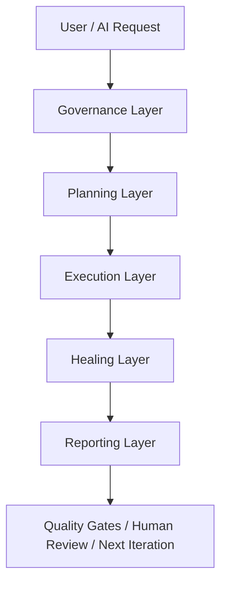
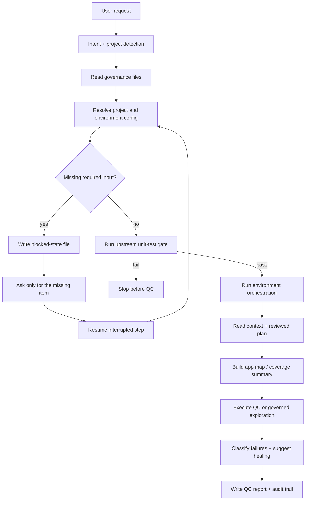
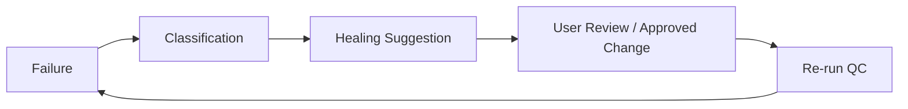
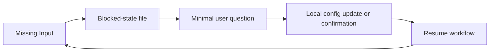
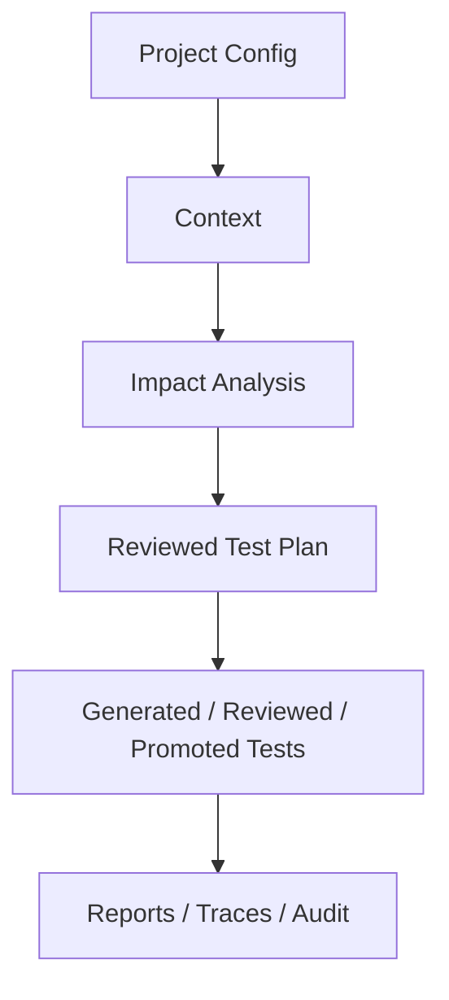

# Architecture

`quality-platform` is an **AI-native QC Platform**, not a plain Playwright project.

It owns governed QC workflows such as E2E, API, visual, external verification, auth bootstrap, reporting, and AI-driven quality orchestration.
It does not own unit tests for internal product code. Unit tests remain the responsibility of each concrete application or service repository.
When a project config points to an existing upstream unit-test command, this platform treats that command as a pre-QC gate and stops before QC if the gate fails.

Recent framework upgrades add five runtime-grade capabilities:

1. failure attribution and healing-loop analysis
2. test environment and data orchestration
3. MCP exploration manifests as executable runtime artifacts
4. app-map based coverage-gap reporting
5. missing-input detection with resumable blocked-state files

## Platform View

This platform is designed as an operating system for governed QC, not as a single test runner.
Playwright is only one part of the execution layer.
The surrounding layers are what make the platform safe, resumable, auditable, and eventually autonomous.

## Layers

1. AI Layer: planner, generator, explorer, runner, healer, reporter, governance.
2. Governance Layer: `AGENTS.md`, `SKILL.md`, AI contracts, lifecycle rules, guards.
3. Planning Layer: context, impact analysis, reviewed test plans.
4. Execution Layer: Playwright tests, auth bootstrap, config discovery, traces, reports.
5. Healing Layer: failure classification and governed repair suggestions.
6. Reporting Layer: QC report, audit trail, CI evidence.

## Layer Responsibilities

```mermaid
flowchart LR
    subgraph AI["AI Layer"]
        A1["Planner"]
        A2["Generator"]
        A3["Explorer"]
        A4["Runner"]
        A5["Healer"]
        A6["Reporter"]
        A7["Governance Agent"]
    end
    subgraph GOV["Governance Layer"]
        G1["AGENTS.md"]
        G2["skills/quality-platform/SKILL.md"]
        G3["AI Contracts"]
        G4["Guard Scripts"]
    end
    subgraph PLAN["Planning Layer"]
        P1["Project Context"]
        P2["Impact Analysis"]
        P3["Reviewed Test Plan"]
        P4["Coverage Gaps"]
    end
    subgraph EXEC["Execution Layer"]
        E1["Project Discovery"]
        E2["Auth Bootstrap"]
        E3["Environment Orchestration"]
        E4["MCP Runtime"]
        E5["Playwright"]
    end
    subgraph HEAL["Healing Layer"]
        H1["Failure Classification"]
        H2["Healing Suggestions"]
        H3["Governed Follow-up"]
    end
    subgraph OUT["Reporting Layer"]
        R1["QC Report"]
        R2["Audit Log"]
        R3["CI Evidence"]
    end
    AI --> GOV --> PLAN --> EXEC --> HEAL --> OUT
```

### AI Layer

Owns intent expansion and workflow orchestration.
It decides what to read, what to run, and when to stop.

### Governance Layer

Owns safety, constraints, and read order.
This is where the platform ensures:

- no long-term test generation without reviewed plans
- no production write by default
- no direct promotion of generated assets
- no silent weakening of assertions

### Planning Layer

Owns product understanding.
It transforms code, docs, route structure, API shape, and exploration signals into reviewed testing intent.

### Execution Layer

Owns actual runtime behavior.
This includes:

- project config discovery
- auth discovery and bootstrap
- upstream unit-test gates
- data and environment orchestration
- Playwright test execution
- MCP exploration runtime artifacts

### Healing Layer

Owns post-failure interpretation.
It turns raw failures into categories such as `auth_issue`, `selector_drift`, `unit_regression`, `environment_issue`, and governed healing suggestions.

### Reporting Layer

Owns durable output.
It records what was read, what was executed, what failed, what is blocked, and what should happen next.

## Request Lifecycle

This lifecycle is what makes the platform feel simple from the outside while still being strict internally.
The user gives one request; the platform expands that request into a governed sequence.

## Closed Loops

The platform is intentionally loop-based:

- failures should lead to classified next actions
- missing inputs should lead to resumable continuation
- coverage gaps should lead to planning work, not hidden drift

## Asset Model

Each artifact has a distinct job:

- config tells the platform how to operate
- context tells the platform what the product is
- reviewed plans tell the platform what long-term tests are allowed
- tests provide stable executable coverage
- reports and audit logs provide evidence and accountability

## Why This Is Not Just Playwright

If this were only a Playwright repository, it would mostly contain specs, page objects, fixtures, and reports.

This platform goes further by adding:

- governed test generation rules
- resumable missing-input handling
- upstream unit-test gates
- test-environment orchestration
- MCP exploration runtime artifacts
- app-map / coverage-gap reasoning
- healing-loop suggestions
- audit-grade QC reports

That combination is what makes it an AI-native QC platform rather than a plain automation project.
